# SpringBoot_RESTful_Api

## 목차
1. Web Service & Web Application
2. Spring Boot 로 개발하는 RESTful API
3. User Service API 추가
4. RESTful Service 기능 확장
5. Spring Boot API 사용
6. JAP
7. RESTful 설계

<br><br><br>


## 1. Web Service & Web Application
1. Web Service:  네트워크 상에서 서로 다른 종류의 컴퓨터들 간에 상호작용하기 위한 소프트웨어 시스템
2. Web Application : 서버에 저장되어 있고 웹 브라우저를 이용해서 실행할 수 있는 애플리케이션
   
   <br>    
    <image src ="https://github.com/seoin1223/SpringBoot_RESTful_Api/assets/129828463/c07cfd34-0557-424b-83cb-2baae2b21944" width = "50%" height="300px"/>

4. SOAP (Simple Object Access Protocol)
     - HTTP, HTTPS, SMTP 등을 이용해서 XML 기반의 메시지를 컴퓨터 네트워크상에서 교환하는 형태의 프로토콜
     - XML RPC
  
   <br>    
   <image src ="https://github.com/seoin1223/SpringBoot_RESTful_Api/assets/129828463/c86669d1-bc36-403e-8ddc-1684dd05d6a3" width = "70%" height="300px"/>

5. REST ( Representational State Transfer)
   - resource의 Representation에 의한 상태 전달
   - HTTP Method를 통해 Resource를 처리하기 위한 아키텍처
6. RESTful : REST API를 제공하는 웹 서비스
7. Resource
    - URL : 인터넷 자원을 나타내는 유일한 주소
    - XML, HTML, JSON
7.EndPoing : API를 통해 서버가 제공하는 리소스에 접근하기 위해서 제공되는 주소
8. OpenAPI
   - https://www.openapis.org/
   - https://spec.openapis.org/oas/v3.1.0
   - https://www.openapis.org/blog/2021/02/16/migrating-from-openapi-3-0-to-3-1-0
     
     <br>
     <image src ="https://github.com/seoin1223/SpringBoot_RESTful_Api/assets/129828463/115ae7b7-a172-48b4-9cfd-5d95fd1bc379" width = "80%" height="400px"/>

<br><br><br><br>

## 2. Spring Boot 로 개발하는 RESTful API

- [프로젝트 생성](https://github.com/seoin1223/SpringBoot_RESTful_Api/tree/seoin/my-restful-service)
- [controller](https://github.com/seoin1223/SpringBoot_RESTful_Api/tree/seoin/my-restful-service/src/main/java/kr/seoin/springboot/myrestfulservice/controller)

  
1. Spring Boot Configuration
    - 동작 원리
    - 설정 파일
       - application.yml : 설정이름:값
       - application.properties : 설정이름 = 값
    - Spring Boot AUto Configuration
  
2. Dispatcher Servlet
   - 클라이언트의 모든 요청을 한곳으로 받아서 처리
   - 요청에 맞는 Handler로 요청을 전달
   - Handler의 실행 결과를 Http Response 형태로 만들어서 반환

3. RestController
   - @Controller + @ResponseBody
   - view를 갖지 않는 REST Data(JSON/XML)를 반환
  
4. Path Variable
    <image src ="https://github.com/seoin1223/SpringBoot_RESTful_Api/assets/129828463/b151f156-a5f4-44e4-a717-28b025048905" width = "100%" height="600px"/>

<br><br><br>

## 3. User Service API 구현
1. User Domain 생성
2. GET
3. POST
4. Exception Handling
   - ServletUriComponentsBuild -> URI 생성 -> ResponseEntity 반환
   - user id 가 존재하지 않을 때도 200 ok 반환 -> throw new UserNotFoundException
5. DELETE


## 4. RESTful Service 기능 확장
1. [Validations API](https://github.com/seoin1223/SpringBoot_RESTful_Api/tree/seoin/my-restful-service/src/main/java/kr/seoin/springboot/myrestfulservice/dao/User.java) 
2. Internaionalization - 다국어 처리
  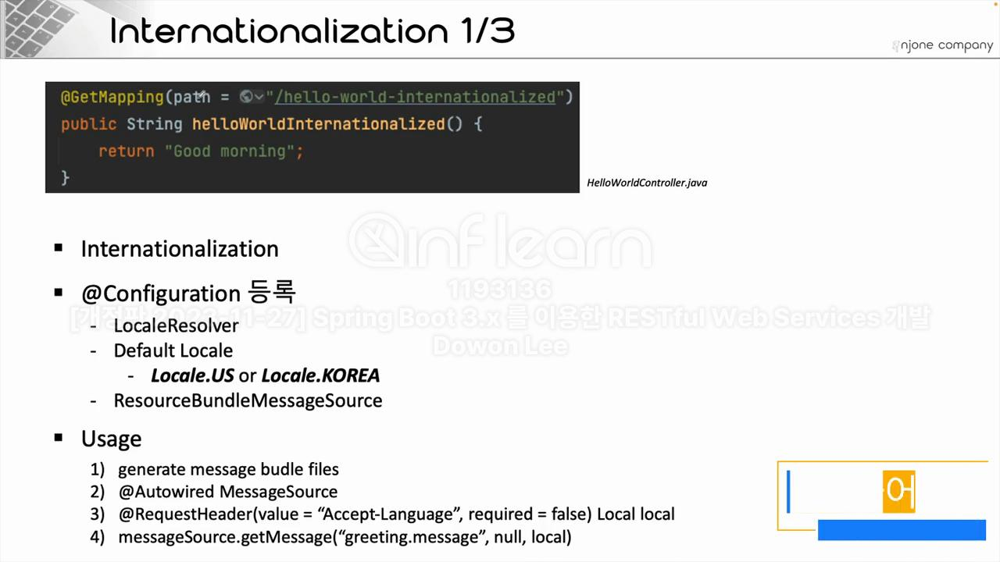

3. Response 데이터 형식 변환 - XML formatasd
   ```properties
   <!-- https://mvnrepository.com/artifact/com.fasterxml.jackson.dataformat/jackson-dataformat-xml -->
           <dependency>
               <groupId>com.fasterxml.jackson.dataformat</groupId>
               <artifactId>jackson-dataformat-xml</artifactId>
               <version>2.16.1</version>
           </dependency>
   ```

4. Response 데이터 제어를 위한 Filtering
   - @JsonIgnore
   - @JsonIgnoreProperties(Value= {})

5. 프로그래밍으로 제어하는 Filtering
   - 개별 사용자 조회
   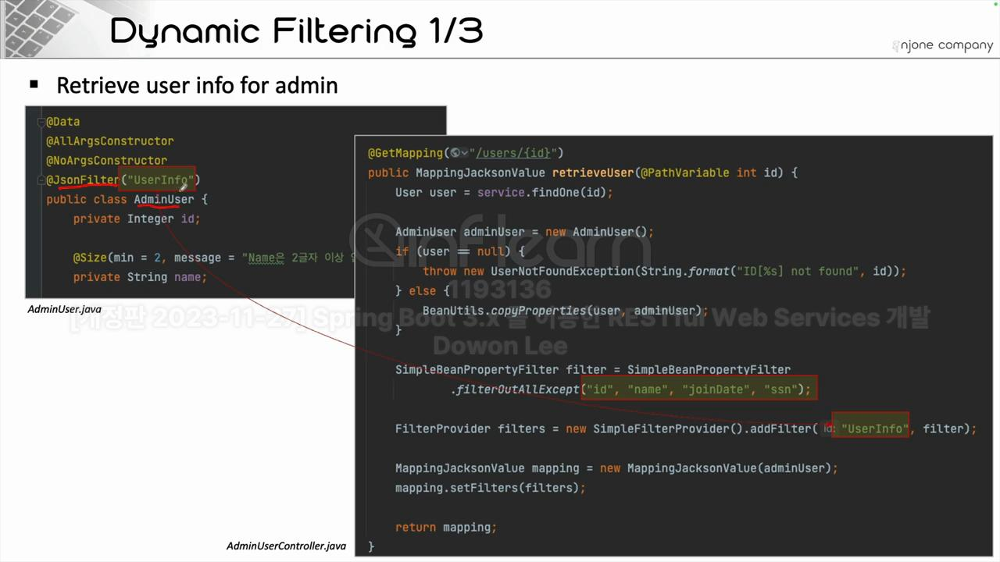
   - 전체 사용자 조회
   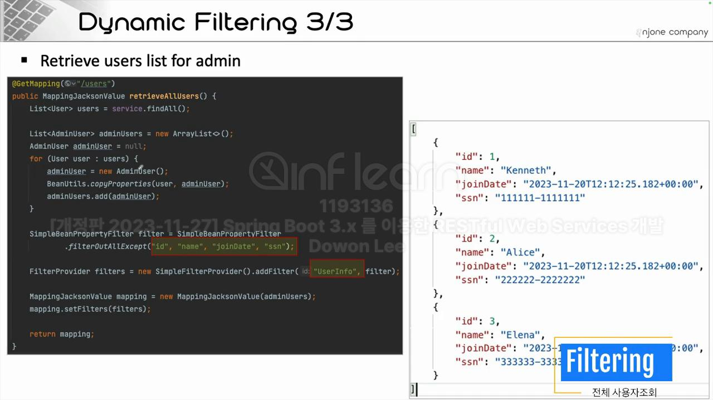

6. Version 관리 
   - URI를 이용한 버전관리
      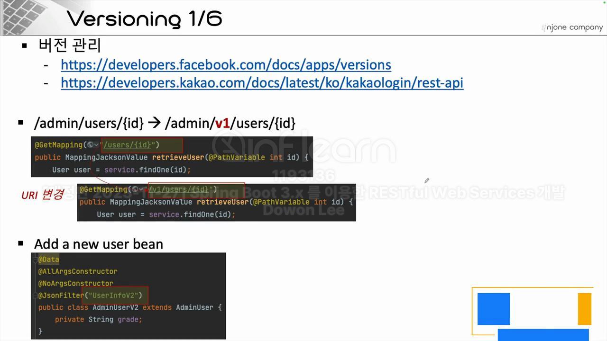
   - Parameter 이용한 버전관리
      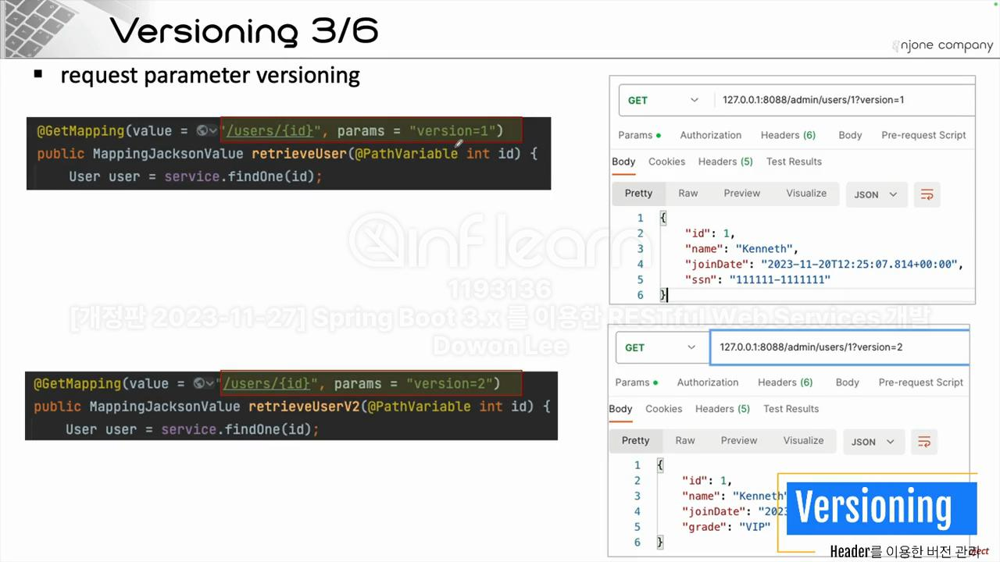
   - Header를 이용한 버전관리
      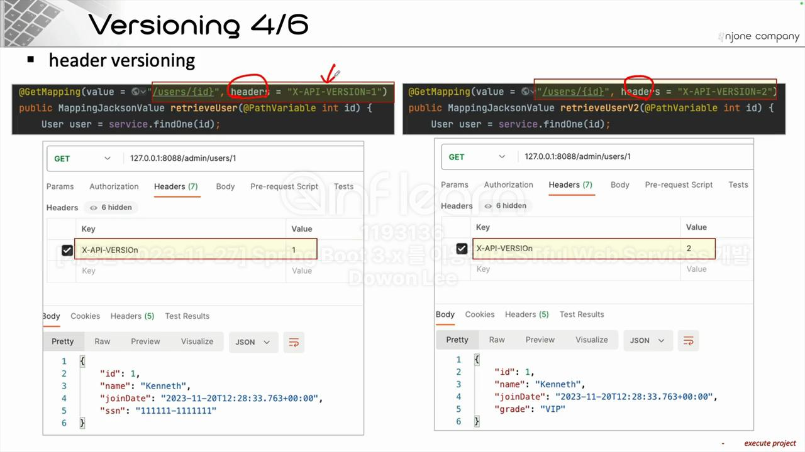
   - min-type
      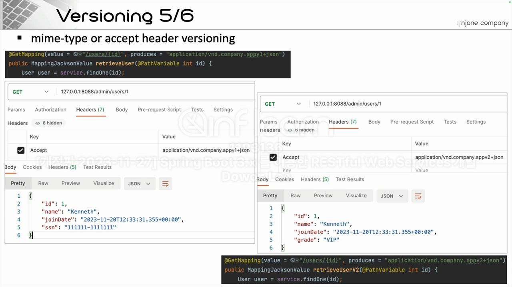
   - summary
      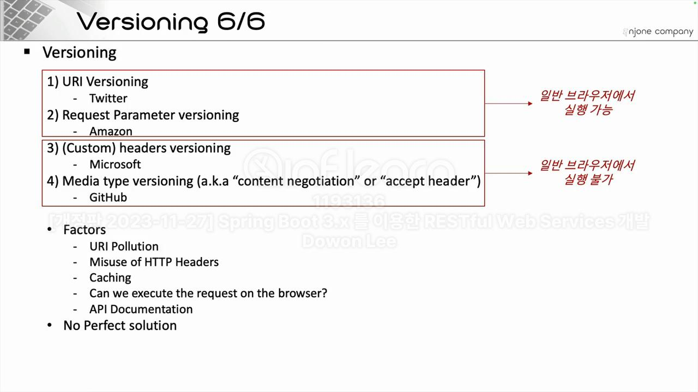


## <span style="color:red" > 5. Spring Boot API 사용</span>

1. HATAOAS
   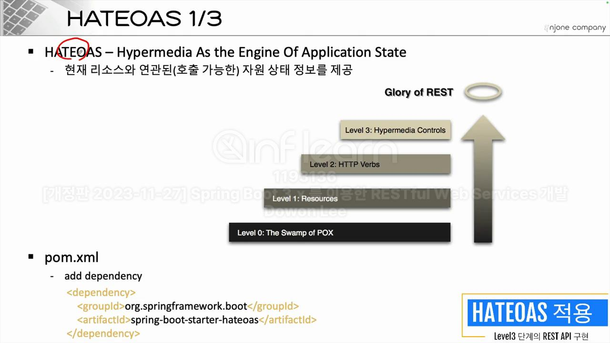 <br><br>

2. Swagger 
   - SpringFox - 2.7.x
     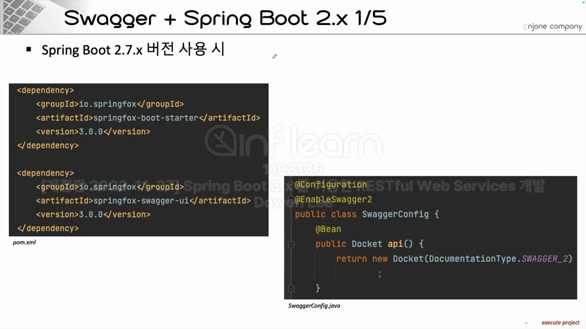
   - SpringDog - 3.1.x
      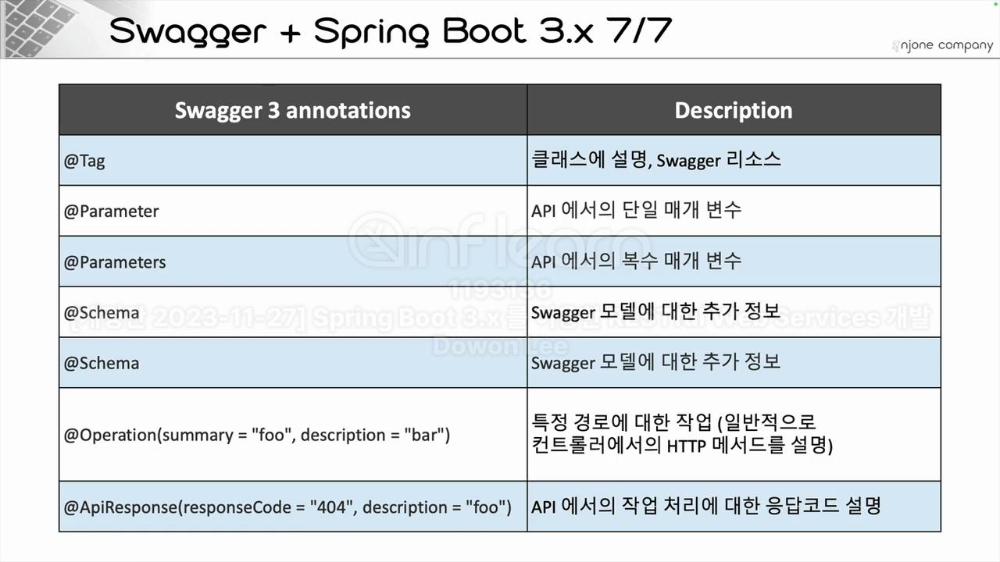 <br><br>

3. Actuator 이용한 모니터링 & Metrics 수집
   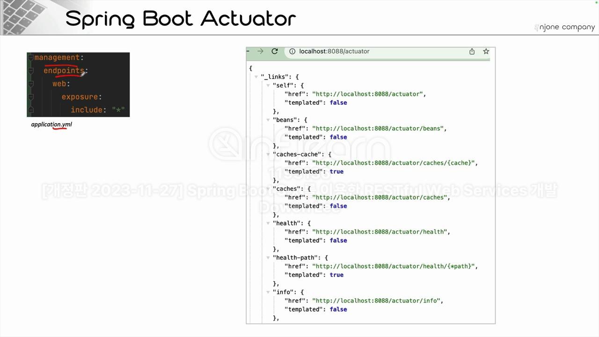 <br><br>

4. HAL Explorer 이용한 API 테스
   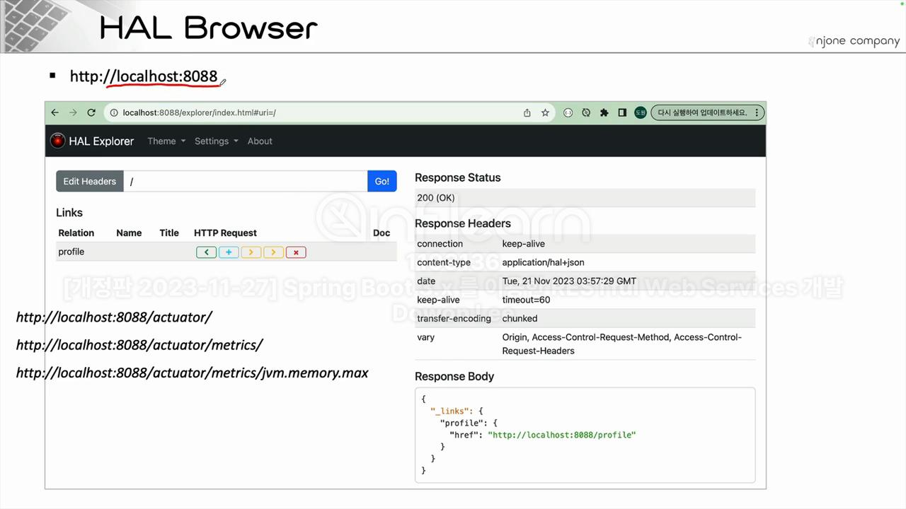
5. SpringSecurity
   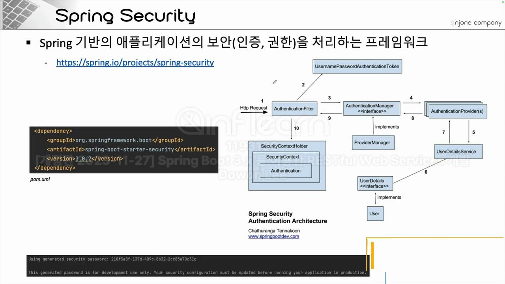

6. 